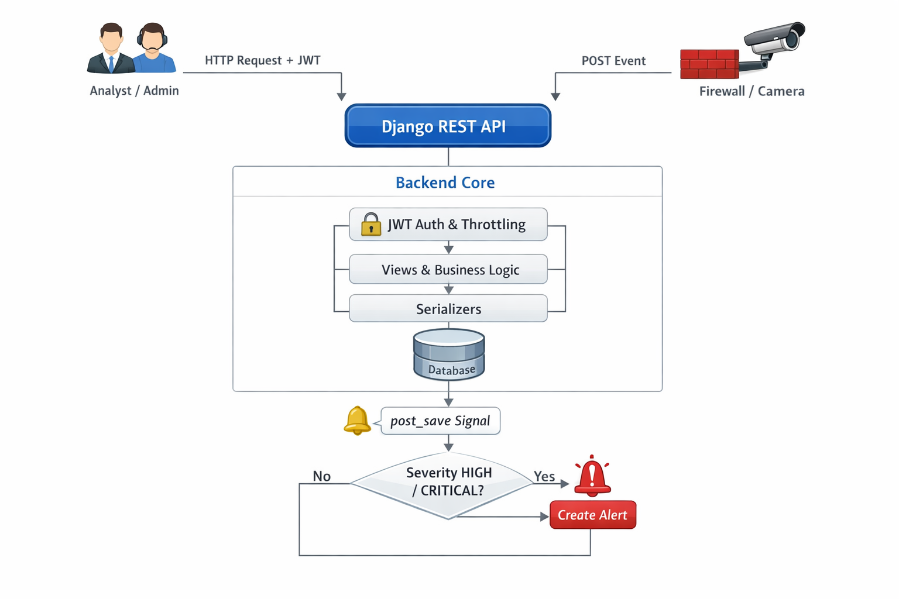

# Threat Monitoring & Alert Management Platform

A scalable, security-first **Backend REST API** designed to ingest security events and automatically generate alerts for high-severity threats.
Built for the **Cyethack Solutions – Developer Assignment**.

---

## 📌 Project Overview

The Threat Alert System acts as a centralized backend for real-time threat monitoring.
It ingests logs from multiple sources (Firewalls, CCTV, Servers, etc.) via REST APIs.
When a **HIGH** or **CRITICAL** severity event is detected, the system **automatically creates an alert** for analysts to review.

---

## ✨ Key Features

* **🚀 Event Ingestion**

  * High-performance API to receive security logs in real time.

* **⚡ Automated Alerting**

  * Uses **Django Signals** to auto-generate alerts for `HIGH` and `CRITICAL` events.

* **🔐 Role-Based Access Control (RBAC)**

  * **Analyst:** Read-only access to view and filter alerts.
  * **Admin:** Full access to manage alerts and update status (OPEN → RESOLVED).

* **🛡️ Security Best Practices**

  * **JWT Authentication** (SimpleJWT)
  * **API Throttling** to prevent brute-force / DDoS attacks
  * **Audit Logging** for critical actions (alert creation & updates)

---

## 🛠️ Tech Stack

* **Backend:** Python 3.10+, Django 5.x
* **API Framework:** Django REST Framework (DRF)
* **Authentication:** SimpleJWT (JWT-based Auth)
* **Database:** SQLite (default) / PostgreSQL (supported)
* **Testing:** Django `APITestCase`

---

## 🏗️ System Architecture



---

## ⚙️ Setup Instructions

You can run this project using **Docker (recommended)** or **Local Python environment**.
Follow the steps based on your preferred setup.

---

## 🐳 Option 1: Run Using Docker & Docker Compose (Recommended)

This approach ensures consistent setup across environments.

### Step 1️⃣ Clone the Repository

```bash
git clone git@github.com:Gauravmehra59/threat_alert_system.git
cd threat_alert_system
```

---

### Step 2️⃣ Create `.env` File

Create a `.env` file in the project root:

```ini
DEBUG=True
SECRET_KEY=your_secret_random_key
ALLOWED_HOSTS=127.0.0.1,localhost
```

---

### Step 3️⃣ Build & Start Containers

```bash
docker-compose up --build
```

This will:

* Build the Django image
* Start the backend service
* Expose the app on port **8000**

---

### Step 4️⃣ Run Database Migrations

Open a new terminal and run:

```bash
docker-compose exec web python manage.py makemigrations
docker-compose exec web python manage.py migrate
```

---

### Step 5️⃣ Create Superuser

```bash
docker-compose exec web python manage.py createsuperuser
```

---

### Step 6️⃣ Access the Application

Open your browser and visit:
👉 **[http://127.0.0.1:8000/admin/](http://127.0.0.1:8000/admin/)**

---

### 🛑 Stop Containers

```bash
docker-compose down
```

---

## 🖥️ Option 2: Run Without Docker (Local Setup)

Use this option if Docker is not installed.

### Step 1️⃣ Clone the Repository

```bash
git clone git@github.com:Gauravmehra59/threat_alert_system.git
cd threat_alert_system
```

---

### Step 2️⃣ (Optional) Create Virtual Environment

```bash
# Windows
python -m venv venv
venv\Scripts\activate

# Mac / Linux
python3 -m venv venv
source venv/bin/activate
```

> ⚠️ Virtual environment is **recommended but optional**

---

### Step 3️⃣ Install Dependencies

```bash
pip install -r requirements.txt
```

---

### Step 4️⃣ Create `.env` File

```ini
DEBUG=True
SECRET_KEY=your_secret_random_key
ALLOWED_HOSTS=127.0.0.1,localhost
```

---

### Step 5️⃣ Run Database Migrations

```bash
python manage.py makemigrations
python manage.py migrate
```

---

### Step 6️⃣ Create Superuser

```bash
python manage.py createsuperuser
```

---

### Step 7️⃣ Start Development Server

```bash
python manage.py runserver
```

---

### Step 8️⃣ Access the Application

Open your browser and visit:
👉 **[http://127.0.0.1:8000/admin/](http://127.0.0.1:8000/admin/)**

---


## 📡 API Endpoints

### 🔐 Authentication

| Method | Endpoint         | Description                  |
| ------ | ---------------- | ---------------------------- |
| POST   | `/api/v1/auth/login/`   | Obtain Access & Refresh JWT  |
| POST   | `/api/v1/auth/refresh/` | Refresh expired Access Token |

---

### 📥 Events (Ingestion)

| Method | Endpoint          | Description              | Access              |
| ------ | ----------------- | ------------------------ | ------------------- |
| POST   | `/api/v1/event/ingest/` | Log a new security event | Authenticated Users |

---

### 🚨 Alerts (Management)

| Method | Endpoint                 | Description                 | Access        |
| ------ | ------------------------ | --------------------------- | ------------- |
| GET    | `/api/v1/alerts/`               | List all alerts (paginated) | Authenticated |
| GET    | `/api/v1/alerts/?severity=HIGH` | Filter by severity          | Authenticated |
| GET    | `/api/v1/alerts/?status=OPEN`   | Filter by status            | Authenticated |
| PATCH  | `/api/v1/alerts/<id>/`          | Update alert status         | Admin Only    |

---

## ✅ Testing

Automated tests verify core functionality, permissions, and signals.

```bash
python manage.py test
```

### Test Coverage

* **Logic:** HIGH / CRITICAL events auto-create alerts
* **Permissions:** Analysts receive `403 Forbidden` on update attempts
* **API:** Successful event ingestion via REST API

---

## 📝 Assumptions Made

* **Event–Alert Relationship:**
  One-to-One relationship (one high-severity event → one alert)

* **Timezone:**
  All timestamps are stored and returned in **UTC**

* **Source Authentication:**
  Sensors use JWT authentication (API Keys recommended for production)

* **Data Retention:**
  No deletion policy; all events and alerts are retained for audit purposes

---

## 📂 Project Structure

```text
threat_alert_system/
├── core/
│   ├── models.py        # Event & Alert models
│   ├── views.py         # API views & permissions
│   ├── serializers.py  # Validation & serialization
│   ├── signals.py      # Auto-alert logic
│   ├── tests.py        # Unit & integration tests
│   └── urls.py         # App routing
├── logs/                # Audit & security logs
├── manage.py
├── requirements.txt
└── README.md
```

---

## 👨‍💻 Author

**Developed for Cyethack Solutions – Backend Developer Assignment**

Gaurav Mehra
---
